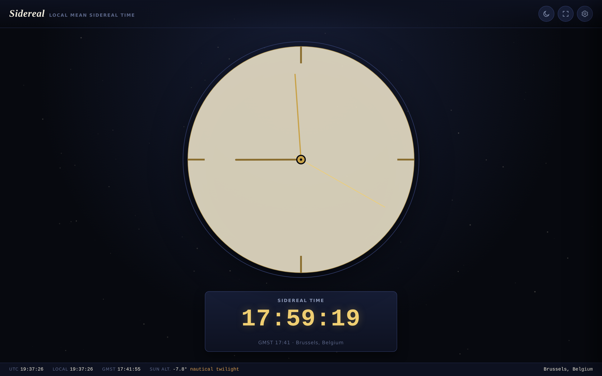
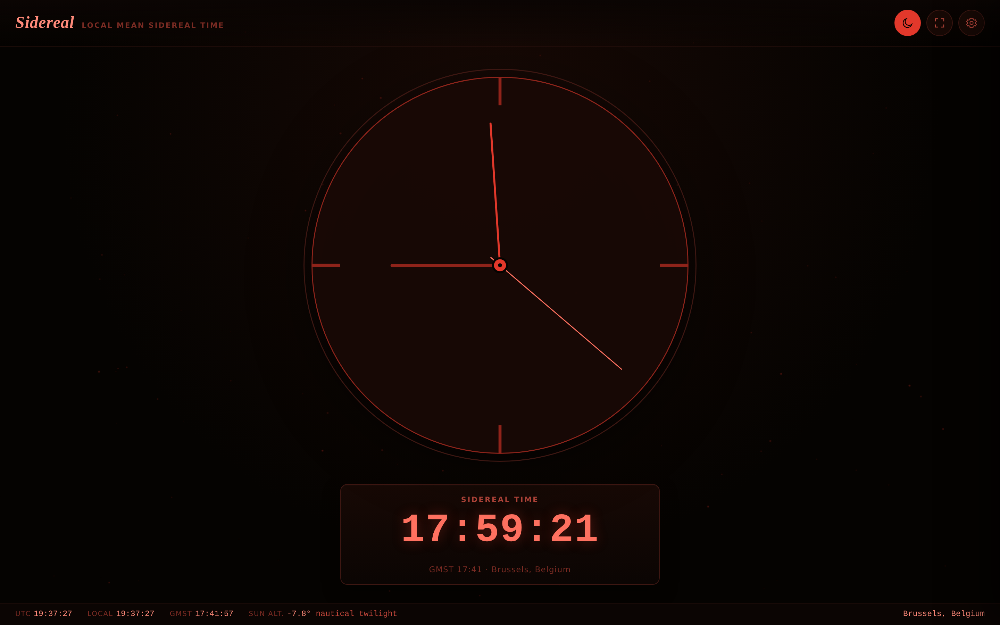

# Sidereal Clock

A full-screen sidereal clock for the browser — analog and digital, with configurable location, time zone, clock source, and a red-on-black night mode for use at the eyepiece. Single HTML file, no build step, no dependencies beyond one Google Fonts stylesheet.

**[Live demo →](https://claude.ai/code/artifact/70e94ea9-100a-495f-8128-7a59b9a09014)**

Night mode

## What is sidereal time?

Sidereal time tracks the rotation of the Earth relative to the distant stars rather than the Sun. A sidereal day (≈23h 56m 4s) is about four minutes shorter than a solar day, so sidereal time slowly drifts against your clock and calendar over the year. Astronomers use it because a given sidereal time always corresponds to the same patch of sky being overhead — useful for planning what's observable and for pointing equatorial mounts and telescopes.

This clock computes **Local Mean Sidereal Time (LMST)** from your longitude and the current UTC instant, using the standard IAU Greenwich Mean Sidereal Time (GMST) polynomial plus your longitude offset.

## Features

- **Analog display** — a minimalist continuous-sweep dial by default (no ticking), plus Classic, Observatory, and Skeleton styles. The dial face itself can be set to a 24-hour layout (once around per sidereal day) or a familiar 12-hour layout (twice around).
- **Digital display** — always shown in 24-hour form for sidereal time (that's the convention astronomers expect); local civil time can be shown alongside it in 12- or 24-hour form, with or without seconds, in either "Mechanical" (monospace) or "Engraved" (serif) numerals.
- **Flexible layout** — analog only, digital only, or both together, and the digital readout can show sidereal time, local time, or both stacked.
- **Location** — set latitude/longitude and a location name by hand, or use the browser's geolocation. Latitude feeds an approximate sun-altitude/twilight indicator in the footer (day / civil / nautical / astronomical twilight / night).
- **Time zone** — any IANA time zone, used to interpret local time display and any custom date/time you set.
- **Clock source** — the live system clock, or a custom start date/time that keeps flowing forward from that point (with play/pause), for previewing sidereal time at another moment.
- **Manual sync correction** — enter a trusted accurate time and the clock computes and applies an offset. Browsers can't speak raw NTP (it needs UDP, which isn't available from a web page), so a preferred-server list is kept as a reference only, not queried live — this manual "Sync now" is the honest working substitute.
- **Night mode** — true red-on-black, toggled manually or automatically once the sun drops below −12° (astronomical dusk) at your location.
- **Settings persist** locally in the browser between visits (`localStorage`), including on reload.

## Getting started

There's nothing to build. Download `sidereal-clock.html` and open it in any modern browser, or host it anywhere that serves static files (GitHub Pages works fine — enable Pages on this repo and point it at the file).

Everything runs client-side. The only network request the page makes is the Google Fonts stylesheet (Cormorant Garamond, Manrope, Martian Mono); if you need it fully offline, remove the `<link>` tags in `<head>` and it will fall back to the system font stack.

### Installing it as an app

The page ships a web manifest and the right meta tags to be installed as a standalone app:

- **Android (Chrome)** — open the page, then "Add to Home screen." It launches full-screen with its own icon, no browser chrome.
- **iOS (Safari)** — Share → "Add to Home Screen." Same result.

## Settings reference

Open the gear icon (top right) for three tabs:

- **Display** — layout, analog style, analog dial hours, what the digital readout shows, local time format, digital numeral style, night mode (manual and automatic).
- **Location** — location name, latitude/longitude, geolocation button, time zone.
- **Time & Sync** — clock source (live vs. custom), the manual sync correction, and the NTP server reference list.

## Accuracy notes

- Sidereal time is computed as **mean** sidereal time (no nutation/equation-of-equinoxes correction), which differs from apparent sidereal time by at most about a second — plenty accurate for a wall clock.
- The sun's position uses a low-precision approximation (accurate to roughly 0.01°), used only to drive the twilight label and optional auto night mode — not for anything requiring arcsecond precision.

## License

MIT — see [LICENSE](LICENSE).
